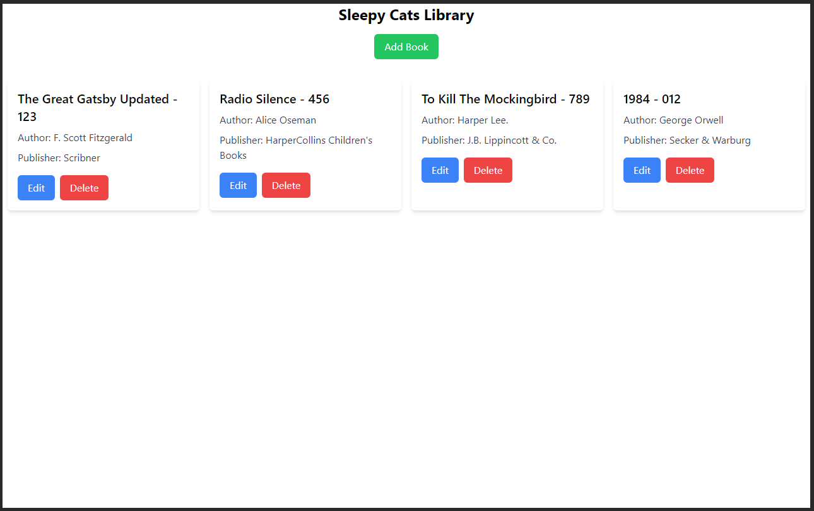

# Sleep Cats Library

> An efficient and user-friendly library management system for cataloging, updating, and managing book information.



### Features

1. Add Books
2. Fetch all Books
3. Delete Books
4. Update Books

### Install dependencies

```bash
# frontend
cd frontend && npm install

# backend
cd backend && npm install
```

**IMPORTANT**

Make sure to add your MongoDB info in `.env` file

Here's an Example of `.env`. Additionally, you can check [**example .env**](./backend/.env.example)

```txt
DBUSER='your-db-user-name'
DBPASS='your-db-user-pass'
DBURI='db.something.mongodb.net'
```

### Run backend and frontend

```bash
# frontend
cd frontend && npm start

# backend
cd backend && node index.js
```
